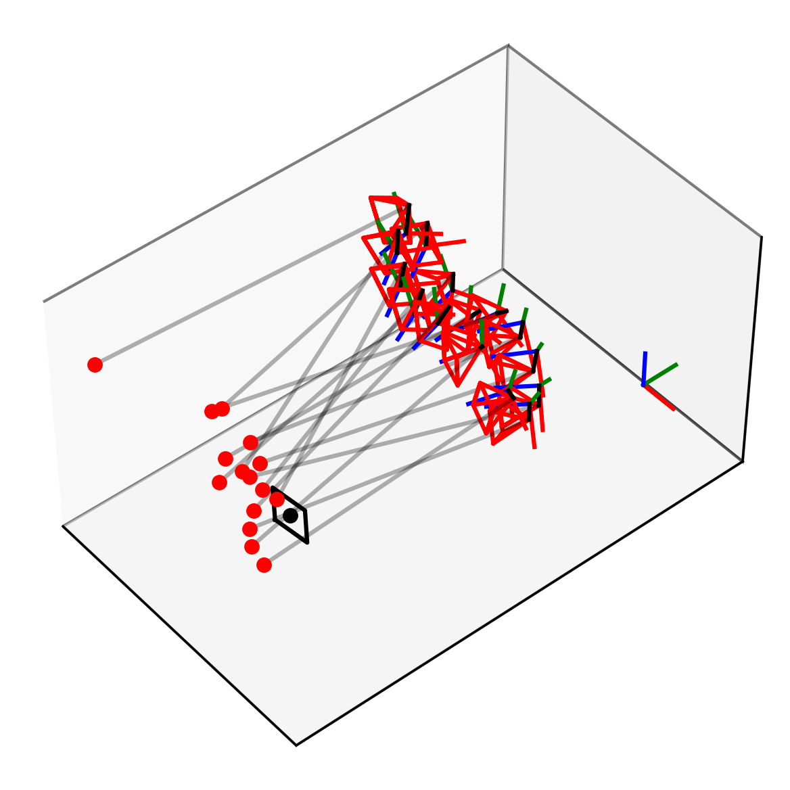
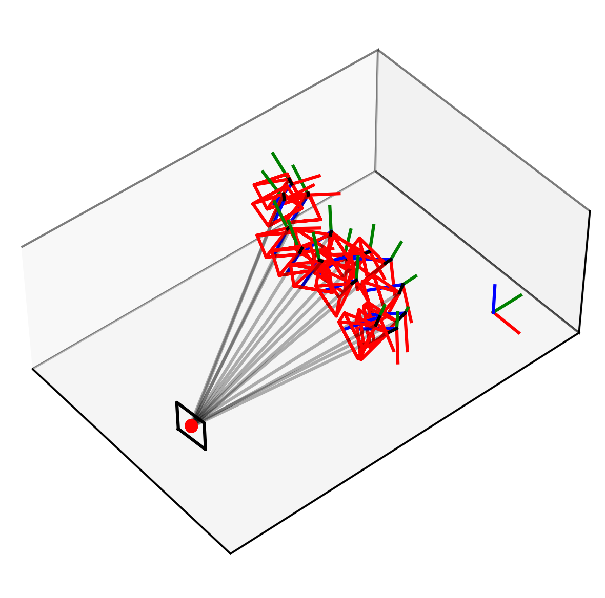
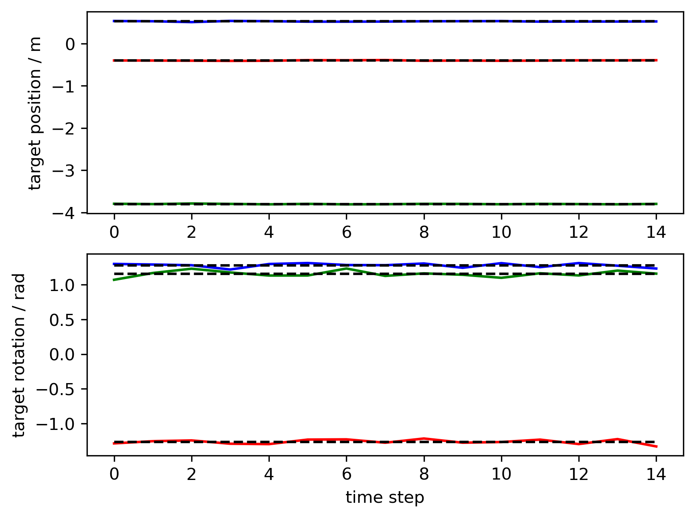
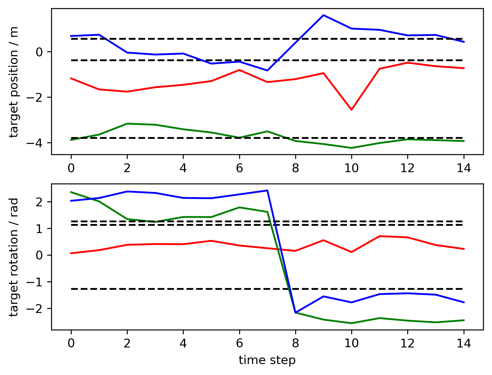
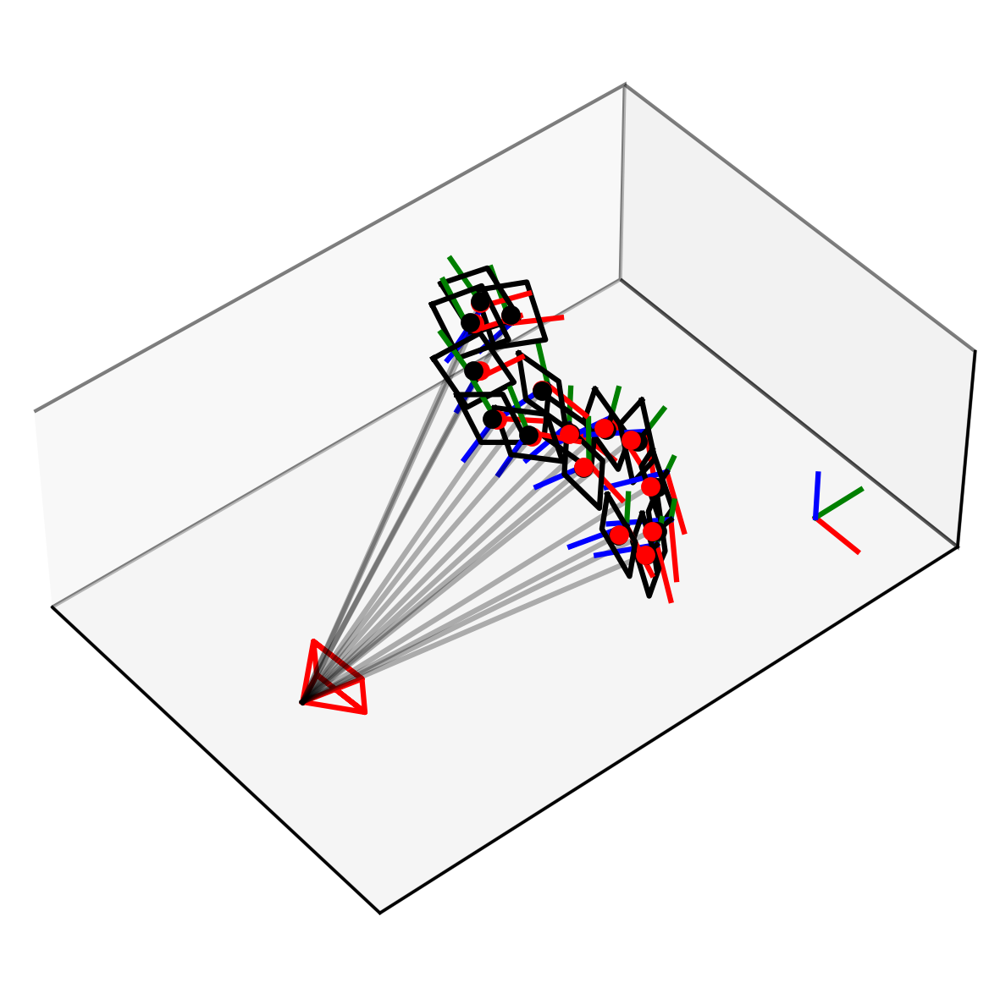

# hand-eye-calibration

 Welcome to this repository, where I’ll be diving into the wonderful world of hand-eye calibration—basically getting robots and cameras to agree on where things are in space without starting an argument.

In this little adventure, I’ll be implementing my own hand-eye calibration algorithm for two setups:

1) A moving camera mounted on a robot’s tool center point (TCP), and

2) A static camera watching the scene.

Now, you might be thinking:
“But Hannes, I don’t have a robotic manipulator that costs more than my car!”
To which I say:

1) Oof, that’s rough. And

2) Fear not! The same concepts I’ll be covering here can also be applied to less bank-breaking problems—like figuring out the relative pose between two regular cameras. For example, stereo camera setups for 3D object localization, using good old disparity and a sprinkle of ArUco markers.

So whether you’ve got a fancy robot arm or just two webcams taped to your desk, there’s something here for you.



In this image is a bad calibration result by the way. Stick around—we're about to calibrate some eyes and fix this image!

## Case 1: Moving Camera, Static Target


 In this setup, you move the robot arm around while making sure the camera always has a clear view of an ArUco marker. The goal is to collect several poses of the robot and corresponding observations of the marker. While I will be using ArUco markers, more commonly in literature chessboard patterns are used. Honestly, is does not really matter as long as you obtain a position and orientation of that board in the camera frame.

Jumping right into the math, you’ll often come across an expression for the position of the marker $`\mathbf{t}_\text{T}`$ in the robot base coordinate system that looks something like this:
```math
\mathbf{t}_\text{T} = \mathbf{t}_\text{TCP}(t) + \mathbf{R}_\text{TCP}(t) \mathbf{t}_\text{C} + \mathbf{R}_\text{TCP}(t) \mathbf{R}_\text{C} \mathbf{t}_\text{M}(t).
```
Here the quantities represent
* $`\mathbf{t}_\text{C}`$ the cameras position in the TCP frame
* $`\mathbf{R}_\text{C}`$ the cameras rotation in the TCP frame
* $`\mathbf{t}_\text{T}`$ the targets position in the base frame
* $`\mathbf{R}_\text{T}`$ the targets rotation in the base frame
* $`\mathbf{t}_\text{TCP}`$ the TCP position in the base frame
* $`\mathbf{R}_\text{TCP}`$ the TCP orientation in the base frame
* $`\mathbf{t}_\text{M}`$ the measured target position in the camera frame
* $`\mathbf{R}_\text{M}`$ the measured target rotation in the camera frame

For the rotation the relationship is similar, however, we also have to consider the rotation of the target. On the TCP side we have the measurements of the target $`\mathbf{t}_\text{T}`$ in the camera frame, given by the rotation $`\mathbf{R}_\text{M}`$ and rotation of the target in the base frame $`\mathbf{R}_\text{T}`$
```math
\mathbf{R}_\text{T} = \mathbf{R}_\text{TCP}(t) \mathbf{R}_\text{C} \mathbf{R}_\text{M}(t).
```
The reason we set up these relationship for the target is, that the target is static, i.e., the value of the left hand side if the two equations is not changing over time. Consequently, the right hand side must be constant as well. This gives us a great starting point to finding the camera's position and rotation.
For a given guess of the camera rotation and translation in the TCP frame only the true answer will result in a constant corresponding target pose for all the different observed TCP poses. The issue is that we do not know the pose of the target. It's not like we couldn't, but we don't need to! And quiet frankly, I am lazy, and I don't want to. It is not easy to do and botching this will ruin the following camera calibration.
Instead, we will minimize the target's variance, possibly without even knowing the target's pose.
As we saw, we can decouple the translation from the orientation. And the expression of the translation depends on the initially unknown camera rotation $`\mathbf{R}_\text{C}`$. So we unfortunately have to start with the slightly more complicated rotations after tackling the translation $`\mathbf{t}_\text{C}`$ of the camera.

### Determining the Cameras Rotation

The reason the rotation is slightly harder is that rotations are not only nonlinear, but there are also several ways to parametrize them—e.g., using a rotation vector, quaternions, or Euler angles. I’ll use a rotation vector to pass to the optimizer later, so I have a minimal representation of the rotation without needing to specify any equality constraints. However, this is only for implementation purposes; all the math will be done with rotation matrices directly, so there’s no need to do any computations with the rotation vectors themselves.

We will need to compute the variance of the expression $`\mathbf{R}_\text{T} = \mathbf{R}_\text{TCP}(t) \mathbf{R}_\text{C} \mathbf{R}_\text{M}(t)`$. There are many ways to approach this—arguably the simplest is to convert each resulting matrix into rotation parameters, average over all the measurements we have, and then minimize the deviation of each set of rotation parameters from this average.

The flaw here is that working with rotation parameters in this way only really works if the rotations are similar enough. A threshold of about 30° is what I’ve seen floating around on the internet. When we have a reasonable initial guess for the camera’s orientation, this assumption is usually fine.

But—as I’ve said—I’m lazy and don’t want to guess how the camera might be oriented. Plus, I want the algorithm to be robust enough to recover the correct solution even from wild initial guesses.

So instead, we’ll work directly with the matrices and compute the angle of the rotation $`\mathbf{I} = \mathbf{R}_\text{TCP}(t) \mathbf{R}_\text{C} \mathbf{R}_\text{M}(t) \mathbf{R}^\text{T}_\text{T}`$ which ideally should be close to zero. For the unknown rotation $`\mathbf{R}_\text{T}`$ we will introduce an additional auxiliary optimization variable. To compute the angle of a rotation we will use the fact that
```math
\text{trace}(\mathbf{R}) = 1 + 2 \cos(\alpha),
```
so the sum of residuals we are trying to minimize is 
```math
J_\text{rot}(\mathbf{x})=\sum^{n}_{t=1} \text{acos}\left(\frac{1}{2}\left(\text{trace}(\mathbf{R}_\text{TCP}(t) \mathbf{R}_\text{C} \mathbf{R}_\text{M}(t) \mathbf{R}^\text{T}_\text{T})-1\right)\right)^2.
```
And with that we are ready to start optimizing. This will hopefully yield the rotation $`\mathbf{R}_\text{C}`$. This was quiet a lengthy process but I promise the following computations are not only easier but pretty much analogous, since we are still trying to minimize the quantities variances. As we introduced the target's orientation as a auxiliary optimization variable we also obtain $`\mathbf{R}_\text{T}`$ as a bonus!

### Determining the Cameras Translation

As promised the approach for the translation $`\mathbf{t}_\text{C}`$ will be pretty similar, so I will try to keep things short. Starting with the initial expression
$`\mathbf{t}_\text{T} = \mathbf{t}_\text{TCP}(t) + \mathbf{R}_\text{TCP}(t) \mathbf{t}_\text{C} + \mathbf{R}_\text{TCP}(t) \mathbf{R}_\text{C} \mathbf{t}_\text{M}(t)`$, we want to minimize its variance. The rotation $`\mathbf{R}_\text{C}`$ now has been identified and only $`\mathbf{t}_\text{C}`$ and $`\mathbf{t}_\text{T}`$ remain unknown. Luckily translations are linear, so by defining $`\mathbf{A}_t := \mathbf{R}_\text{TCP}(t)`$ and $`\mathbf{b}_t := -\mathbf{t}_\text{TCP}(t) - \mathbf{R}_\text{TCP}(t) \mathbf{R}_\text{C} \mathbf{t}_\text{M}(t)`$ we get the residual
```math
\begin{bmatrix} \mathbf{A}_1 & -\bm{I} \\\ \vdots & \vdots \\\ \mathbf{A}_n & -\bm{I} \end{bmatrix} \begin{bmatrix} \mathbf{t}_\text{C} \\\ \mathbf{t}_\text{T} \end{bmatrix} - \begin{bmatrix} \mathbf{b}_1 \\\ \vdots \\\ \mathbf{b}_n \end{bmatrix}=:\mathbf{A}\mathbf{x}-\mathbf{b}
```
and as we want to minimize the variance, our residual becomes
```math
J_\text{trans}(\mathbf{x})=\lVert\mathbf{A}\mathbf{x}-\mathbf{b}\rVert_2^2.
```
So similar to the approach taken for the rotation an additional optimization variable $`\mathbf{t}_\text{T}`$ is introduced for the target. That expression looks familiar, huh? We are once again trying to solve a linear least squares problem!

I won’t get into the details of how to solve these (not this time), but I do want to ramble a bit about the kinds of problem setups you might end up with. In this case, out of pure laziness, I introduced an auxiliary optimization variable.

However, it’s worth noting that you can skip introducing this auxiliary variable altogether by minimizing the deviation from the parametrized mean directly. In this context, that usually means computing the average of all translation vectors (a centroid, essentially), and then minimizing the squared error from each measurement to that mean.
In my [previous post](https://github.com/heschmann/Multi-camera-disparity-in-computer-vision/tree/main) where I explored multi camera disparity in computer vision I used a similar approach. There I promised to show that they are actually the same thing under some assumptions. So if you are interested in learning more about this, hang tight and stay until the end/ the appendix!

To give an example here are two time series of the predicted target translation and rotation vector, guess which one is the better solution (hint: it's the one with the lower variance) ;)



## Case 2: Moving Target on the TCP, Static Camera


In some cases you might not fix your camera to the TCP but have it fixed somewhere in the environment. In this case you would need to move the target. For simplicity, let's assume the target we are using here is bolted to the TCP in an arbitrary way. The position of the target and rotation of the target are in the TCP frame now. The following vector equation expresses the relationship between our quantities
```math
\mathbf{R}_\text{TCP}(t) \mathbf{t}_\text{T} + \mathbf{t}_\text{TCP}(t) = \mathbf{t}_\text{C}(t) +  \mathbf{R}_\text{C} \mathbf{t}_\text{M}(t).
```
Here the quantities represent
* $`\mathbf{t}_\text{C}`$ the cameras position in the base frame
* $`\mathbf{R}_\text{C}`$ the cameras rotation in the base frame
* $`\mathbf{t}_\text{T}`$ the targets position in the TCP frame
* $`\mathbf{R}_\text{T}`$ the targets rotation in the TCP frame
* $`\mathbf{t}_\text{TCP}`$ the TCP position in the base frame
* $`\mathbf{R}_\text{TCP}`$ the TCP orientation in the base frame
* $`\mathbf{t}_\text{M}`$ the measured target position in the camera frame
* $`\mathbf{R}_\text{M}`$ the measured target rotation in the camera frame
Note, that some vectors are now represented in the base frame rather than the TCP frame and vice versa. Analogously, for the rotation we obtain
```math
\mathbf{R}_\text{TCP}(t) \mathbf{R}_\text{T} = \mathbf{R}_\text{C} \mathbf{R}_\text{M}(t).
```

### Determining the Cameras Rotation

We have seen this already, the previous equations just change slightly:
```math
\mathbf{R}_\text{T} = \mathbf{R}_\text{TCP}^\text{T}(t)\mathbf{R}_\text{C} \mathbf{R}_\text{M}(t).
```
So the sum of residuals we are trying to minimize is 
```math
J_\text{rot}(\mathbf{x})=\sum^{n}_{t=1} \text{acos}\left(\frac{1}{2}\left(\text{trace}(\mathbf{R}_\text{TCP}^\text{T}(t) \mathbf{R}_\text{C} \mathbf{R}_\text{M}(t) \mathbf{R}^\text{T}_\text{T})-1\right)\right)^2.
```

### Determining the Cameras Translation

Using the same notation as in the first case, we define $`\mathbf{A}_t := \mathbf{R}_\text{TCP}^\text{T}(t)`$ and $`\mathbf{b}_t := \mathbf{R}_\text{TCP}^\text{T}(t) \mathbf{t}_\text{TCP}(t) - \mathbf{R}_\text{TCP}^\text{T}(t) \mathbf{R}_\text{C}(t) \mathbf{R}_\text{C} \mathbf{t}_\text{M}(t)`$. As a result, we again obtain the targets and cameras position in their respective coordinate systems.

## Optimizing the Rotation and the Translation Jointly
Previously, we optimized the rotation and translation sequentially—first solving for the rotation, then computing the translation based on that result. While this works, it’s not always the most robust approach, especially when small errors in rotation can propagate and significantly affect the translation.

Instead, we can optimize both rotation and translation jointly in a single optimization problem.
One of the key advantages of this joint approach is that it allows us to incorporate additional constraints. For example, if we know that the camera must be mounted at a fixed distance from the TCP, we can reject solutions where the resulting translation vector deviates too far from that expected magnitude.

The joint residual becomes
```math
J_\text{joint}(\mathbf{x}) = J_\text{rot}(\mathbf{x}) + \alpha J_\text{trans}(\mathbf{x})
```
where $`\alpha\geq 0`$ is the weighting factor for adjusting the influence of the translation vs. rotation. The optimization vector in my specific case is still the parametrized orientation for the camera and the target, while the targets and cameras translation will still be computed from the least squares solution.
Additionally, we can include additional information in the form of constraints! This might help guide the optimization towards the best solution and, e.g.,  penalizes camera and target positions that do not align with what we know about the robot-camera setup. A few things that you might be able to guess are the distance of the camera from the TCP/ the origin and the distance of the target from the origin/ the TCP. This corresponds to constraints of the form
```math
 d_\text{C} - \Delta d_{\text{C}}\leq\lVert\mathbf{t}_\text{C}\rVert_2\leq d_\text{C} + \Delta d_{\text{C}}
```
```math
 d_\text{T} - \Delta d_{\text{T}}\leq\lVert\mathbf{t}_\text{T}\rVert_2\leq d_\text{T} + \Delta d_{\text{T}}
```
where $`d_\text{C/T}\geq 0`$ is the guess for the distance of $`\mathbf{t}_\text{C/T}`$ and $`\Delta d_\text{C/T}\geq 0`$ is the uncertainty of the guess. So if we know the origin of the camera is 125mm $`\pm`$ 5mm from the TCP, we would set $`d_\text{C}=0.125`$ and $`\Delta d_\text{C}=0.005`$. An even more insightful information would be a precise guess for the Cartesian position of these two quantities in their respective coordinate systems. These constraints take the form
```math
 \lVert\mathbf{t}_\text{C}-\mathbf{t}_\text{guess,C}\rVert_2\leq r_\text{C}
```
```math
 \lVert\mathbf{t}_\text{T}-\mathbf{t}_\text{guess,T}\rVert_2\leq r_\text{T}
```
where $`\mathbf{t}_\text{C/T,guess}`$ is the guess for the camera and target position and $`r_\text{C/T}\geq 0`$ is the radius of a ball around this guess we expect the true values to be in. Of course these four constraints can be combined. It is also possible to include other constraints, but these four are the ones I implemented. Note, that you should know what you are doing here, as specifying wrong prior information via these constraints can also drive away the optimizer form the true solution when the constraints are not reflected in reality. As a rule of thumb, I would suggest not specifying any constraints initially and then checking wether including them improves the solution (judging based in the residuals for translation and rotation). Moreover, the initial guess of the optimization (the rotation vectors of the camera and target) should ideally be chosen such that the constraints are initially satisfied.

When can it be beneficial to include constraints?
- Do you have high measurement noise (translation or rotation)
- Do you only have a low number of measurements?
- Do you have (approximate) additional information about the magnitude of the targets or cameras position vector or its rough position in Cartesian space?
- Does the sequential approach give bad results?

If any of these questions was answered with yes: Just give it a go!
Another factor is computational complexity. If you are impatient, have a high number of samples, or only need approximate results. Optimizing the rotation jointly with the translation is not something I would recommend.

## Leveraging the Results for Visual Disparity
The same hand-eye calibration principles can be applied beyond robotic manipulators—particularly in setups involving visual disparity between two cameras. Imagine two cameras both observing the same ArUco marker. In this case, we typically don’t have a robot arm or a TCP (Tool Center Point), but that’s not a problem.

Instead, we treat the ArUco marker as our virtual TCP. The measurement vector and rotation from the second camera come directly from its ArUco marker detection. Likewise, the position and orientation of the first camera are also obtained from its ArUco marker observation. So, where a robot would normally provide forward kinematics, we now substitute in the ArUco-based pose of the first camera. From here, we can apply the same methods as before.

This technique isn’t just for stereo camera rigs—it generalizes to other domains as well. One example is virtual reality: say you want to overlay a simulated object onto the live camera feed. You need to know the camera’s pose in space (its extrinsics) and how it maps 3D points to 2D image coordinates (its intrinsics). With the camera pose identified via ArUco markers (as described above), and the object’s position known from a simulation or tracking system, you can project the object accurately into the camera view.

So whether you’re triangulating depth from two webcams or dropping a digital dragon into your AR app, the foundation is the same: estimate poses, transform between coordinate frames, and let the math do the magic.

## Appendix
Here I put some thoughts that are worth sharing but are not strictly needed to understand what we are trying to do.

### Equivalence of Some Translation Residuals
Suppose instead for taking the approach for obtaining the translation as above, we rewrite take our vector matrix equations for the unknown target position:
```math
\mathbf{t}_\text{T} = \mathbf{A}_t \mathbf{t}_\text{C} - \mathbf{b}_t,
```
or in matrix form
```math
\begin{bmatrix} \mathbf{A}_1 \\\ \vdots \\\ \mathbf{A}_n \end{bmatrix} \mathbf{t}_\text{C} - \begin{bmatrix} \mathbf{b}_1 \\\ \vdots \\\ \mathbf{b}_n \end{bmatrix}=:\mathbf{A}\mathbf{t}_\text{C} - \mathbf{b}.
```
Instead of minimizing the distance of this expression to an additional optimization variable, as we merely want to minimize this expressions variance, we can take a different approach using the so called centering matrix
```math
\mathbf{H}:= \begin{bmatrix} \frac{n-1}{n}\mathbf{I} & \dots &  \frac{-1}{n}\mathbf{I}\\\ \vdots & \ddots & \vdots \\\ \frac{-1}{n}\mathbf{I} & \dots &  \frac{n-1}{n}\mathbf{I} \end{bmatrix} = \mathbf{I}_{3n} - \frac{1}{n} \bm{1}\bm{1}^\text{T} \otimes \mathbf{I}_{3}
```
with Krockecker product .
The left multiplication with this special matrix effectively centers or data in a block-wise fashion
```math
\mathbf{H}(\mathbf{A}\mathbf{t}_\text{C} - \mathbf{b})
```
by shifting everything by the mean over all the time steps
```math
\mathbf{t}_\text{T} \approx \frac{1}{n}\sum^{n}_{t=1} \mathbf{A}_t \mathbf{t}_\text{C} - \frac{1}{n}\sum^{n}_{t=1}\mathbf{b}_t =: \tilde{\mathbf{A}}_t \mathbf{t}_\text{C} - \tilde{\mathbf{b}}_t.
```
One question one might ask is wether this approach gives a similar result vs. the approach taken before. The answer is YES! In fact the two (or three approaches depending on wether you count the explicit subtraction of the mean separately) approaches are equivalent. In the following, I want to motivate why.
Remember that
```math
\begin{bmatrix} \mathbf{A}_1 & -\bm{I} \\\ \vdots & \vdots \\\ \mathbf{A}_n & -\bm{I} \end{bmatrix} \begin{bmatrix} \mathbf{t}_\text{C} \\\ \mathbf{t}_\text{T} \end{bmatrix} - \begin{bmatrix} \mathbf{b}_1 \\\ \vdots \\\ \mathbf{b}_n \end{bmatrix}=:\mathbf{A}\mathbf{x}-\mathbf{b}
```
and
```math
J_\text{trans}(\mathbf{x})=\lVert\mathbf{A}\mathbf{x}-\mathbf{b}\rVert_2^2 = \sum_{t=1}^{n}\lVert\mathbf{A}_i\mathbf{t}_\text{C}-\mathbf{b}_i-\mathbf{t}_\text{T}\rVert_2^2.
```
We want that the partial derivative wrt. our optimization variable is zero. So let us take the partial derivative with respect to the target $`\mathbf{t}_\text{T}`$
```math
\frac{\partial J_\text{trans}}{\partial\mathbf{t}_\text{T}}=0=-2\sum_{t=1}^{n}(\mathbf{A}_i\mathbf{t}_\text{C}-\mathbf{b}_i-\mathbf{t}_\text{T}) = n\mathbf{t}_\text{T} -\sum_{t=1}^{n}(\mathbf{A}_i\mathbf{t}_\text{C}-\mathbf{b}_i)
```
and rearranging for the target $`\mathbf{t}_\text{T}`$
```math
\mathbf{t}_\text{T}=\frac{1}{n}\sum_{t=1}^{n}\mathbf{A}_i\mathbf{t}_\text{C}-\frac{1}{n}\sum_{t=1}^{n}\mathbf{b}_i = \tilde{\mathbf{A}}_t \mathbf{t}_\text{C} - \tilde{\mathbf{b}}_t
```
we obtain the mean parametrized by the camera position $`\mathbf{t}_\text{C}`$. This is what we substituted in the alternative approach and what we implicitly did when using the centering matrix.